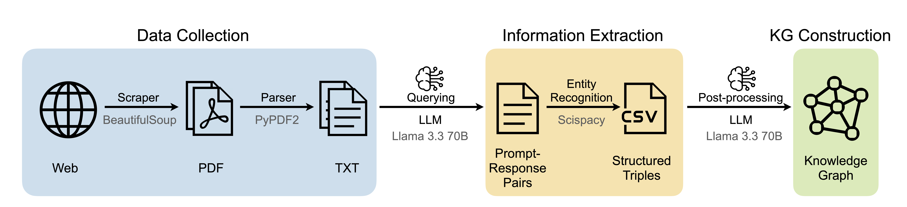

<p align="center">
  
</p>
<h1 align="center">MEDAKA: Construction of Biomedical Knowledge Graphs Using Large Language Models</h1>

<div align="left">
  <a href="https://huggingface.co/datasets/medaka25/MEDAKA-v0.1/resolve/main/medaka_v0.1.csv?download=true" download>
    
  </a>
</div>


---

## Table of Contents

| [Releases](#releases) | [TL;DR](#tldr) | [Features](#features) | [Pipeline](#pipeline) | [Description](#description) | [Installation](#installation) | [Usage](#usage) |

---

## 📌 Releases [[Back to Top]︎](#table-of-contents)
> 📢 **v0.1 is out now!**  
> Stay tuned for upcoming releases — new versions of the MEDAKA dataset and pipeline improvements will be announced here.

### v0.1 - Latest Version
🔗 [View Dataset on Hugging Face](https://huggingface.co/datasets/medaka25/MEDAKA-v0.1)

### v0.0 - Initial Upload  
🔗 [View Dataset on Hugging Face](https://huggingface.co/datasets/medaka25/MEDAKA)

---

## ⚡ TL;DR [[Back to Top]︎](#table-of-contents)

We introduce a two-fold contribution:

1️⃣ A **hackable, end-to-end pipeline** that constructs biomedical knowledge graphs from unstructured web data using a **web scraper, fuzzy matching, and LLMs**.  
2️⃣ A **curated dataset** generated by applying this method to publicly available **drug leaflets** sourced from online pharmacies — capturing drug-centric attributes often missing in existing biomedical KGs.

**[Download the latest version of MEDAKA(v0.1) from Hugging Face Hub](https://huggingface.co/datasets/medaka25/MEDAKA-v0.1)** to explore clinically relevant information beyond molecular data.

### <a name="figure-1-pipeline"></a>
<p align="center">
  
</p>
<em>Figure 1: Pipeline</em>

---

## ✨ Features [[Back to Top]︎](#table-of-contents)

- **End-to-End KG Pipeline:**  A modular and hackable pipeline that extracts structured knowledge from unstructured text using web scraping, LLMs, NER, and relation mapping. Both the LLM and scraper components can be easily replaced or customized.

- **Drug Leaflet-Centric Knowledge Graph:**  Constructed from 13,000+ drug leaflets sourced from the HPRA, capturing real-world, patient-facing clinical data often overlooked in existing biomedical resources.

- **LLM-Based Information Extraction:**  Utilizes LLaMA 3 70B Instruct for prompt-based extraction of subject–predicate–object triples directly from full-text PDFs, avoiding the need for chunking and preserving context.

- **Ready-to-Use Dataset:** The resulting knowledge graph can be downloaded from [Hugging Face Hub](https://huggingface.co/datasets/medaka25/MEDAKA-v0.1) in a ready-to-use CSV format.

- **Broader Clinical Coverage:**  Captures practical features often missing in other biomedical KGs and databases, including storage information, physical appearance (shape, color), and inactive ingredients.

- **Generalizable & Open Source:**  The pipeline is reusable and adaptable across domains and document types, and the full codebase is open source.

---

## 🧬 Pipeline [[Back to Top]︎](#table-of-contents)

We present an end-to-end pipeline for constructing a biomedical knowledge graph from unstructured drug leaflet data.

- The process begins with **data collection**, where drug leaflets are scraped from online pharmacies using a Python-based web scraper and converted into machine-readable text.

- Next, this raw text is processed using a **prompt-based approach with a Large Language Model** for information extraction, focusing on drug-related entities and their relationships.

- Extracted entities are further refined using **Named Entity Recognition** and **relation mapping**, then transformed into graph nodes and labeled edges.

Finally, the data is post-processed and organized into a **CSV format**, forming the foundation of the knowledge graph.

> 📌 *[Figure 1](#figure-1-pipeline) above shows a visual overview of the pipeline, highlighting each step from raw data collection to graph construction.*

---

## 📊 Description [[Back to Top]︎](#table-of-contents)

As a demonstration of our general pipeline for the construction of KGs, we implemented and evaluated a case study focused on drug leaflets. The resulting KG, MEDAKA contains a total of 457,267 subject–predicate–object triples, covering 22,471 unique entities and 10 different relation types. The average node degree is 40.70. The following figures 2 and 3 show the distribution of various entity types and relation types in the dataset.

<table width="100%">
  <tr>
    <td align="center" width="50%">
      <br>
      <em>Figure 2: Entity Type Distribution</em>
    </td>
    <td align="center" width="50%">
      <br>
      <em>Figure 3: Relation Type Distribution</em>
    </td>
  </tr>
</table>

---

## Installation [[Back to Top]︎](#table-of-contents)

Follow these steps to set up the project locally:

### 1. Clone the repository
```bash
git clone https://github.com/medaka25/medaka.git
cd medaka
```

### 2. Create and activate virtual environment
Choose one of the following:

- **Option A: Using `venv`**
```bash
python3 -m venv env
source env/bin/activate  # On Windows: env\Scripts\activate
```
- **Option B: Using `conda`**
```bash
conda create --name medaka-env python=3.10
conda activate medaka-env
```

### 3. Install dependencies
```bash
pip install -r requirements.txt
```

---

## Usage [[Back to Top]︎](#table-of-contents)
The pipeline is divided into multiple stages for modular processing:

### 1. Data Scraping
- **Step 1: Extract Source Code**
```bash
python scripts/scrape_html_sources.py
```
Scrapes the [HPRA website](https://www.hpra.ie) using BeautifulSoup and extracts source code with links to drug leaflet pages. You may use a scraper of your choice.
- **Step 2: Download PDFs from Extracted URLs**
```bash
python scripts/download_pdfs.py --rtf_path ./sourcecode.rtf --output_folder ./data
```
Downloads the actual drug leaflet PDFs based on the extracted page source code.

### 2. Information Extraction Using LLM
- **Step 3: Extract Structured Data from PDFs**
```bash
python scripts/extract_information.py \
  --pdf_dir ./data \
  --output ./medaka.txt \
  --llm_url <your_llm_url> \
  --llm_model <your_model_name>
```
Uses a locally hosted LLM (e.g., LLaMA 3 70B Instruct) to extract drug-related information using prompts. Outputs are saved as Question(Prompt)-Answer(LLM Response) pairs in a single .txt file. Replace the LLM arguments with your preferred model and endpoint.


### 3. Knowledge Graph Construction
- **Step 4: Extract Normalized Medical Terms (Preprocessing)**
```bash
python scripts/extract_medical_terms.py --input ./medaka.txt --output ./final_medical_terms.txt
```
Generates a list of medical terms from the Q&A-format .txt file using named entity recognition. These terms are used for fuzzy matching and normalization in the subsequent KG construction step.
- **Step 5: Build Initial KG in CSV Format**
```bash
python scripts/build_kg_csv.py --input medaka.txt --terms final_medical_terms.txt --output medaka_complete_network.csv
```
Parses the extracted .txt file and and the curated medical terms list, performs entity recognition and relation mapping, and constructs a raw KG in CSV format.
- **Step 6: Post-Processing**
```bash
python scripts/postprocess_kg.py \
  --input ./medaka_complete_network.csv \
  --final_output ./medaka_processed_network.csv \
  --log_dir ./logs \
  --llm_url <your_llm_url> \
  --llm_model <your_model_name>
```
Performs post-processing and cleaning like entity shortening using a locally hosted LLM (LLaMA 3 70B Instruct). Replace the LLM arguments with your preferred model and endpoint.
- **Step 7: Cleaning & Final KG Generation**
```bash
python clean_kg.py --input data/medaka_processed_network.csv --output data/medaka.csv
```
Performs a final cleaning to remove null and noisy values, and duplicates. Generates the final dataset as a CSV file.

### 4. Graph Statistics
```bash
python scripts/kg_stats.py --input data/medaka.csv
```
Explores key graph statistics of MEDAKA including:
- Node & edge counts
- Predicate-wise statistics
- Degree distributions, graph connectivity, betweenness centrality and assortativity
- Top drugs based on the count of relations
